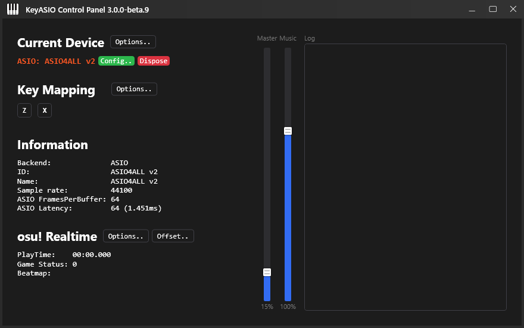

# KeyASIO.Net
Low-latency and safe osu! audio playback experience (ASIO support).

**NOTE:** The `RealtimeMode` in the configuration use [ORTDP](https://github.com/OsuSync/OsuRTDataProvider) to read(only) osu's memory, but it will not modify the memory. The ORTDP is commonly used for broadcasting and approved by peppy, so it's relatively safe. But I still can't guarantee that nothing will happen, so I should still say please do at your own risk :#.

## Overview 

Benifits of KeyASIO.Net
1. Support extremely low-latency playback around 0.5ms *(Verified by [EmertxE](https://osu.ppy.sh/users/954557))*.
2. Fully support for playing beatmap's custom hitsound. (WIP)
3. Safe relatively. I cannot say it's absolutely safe, but the software use ORTDP's provided data, which is commonly used for broadcasting and approved by peppy.
4. A easy-to-use user interface.

## Configuration
The least steps:
1. Change the device in the software GUI.
2. Change your own key bindings in the software GUI.
3. Set the effect volume to 0 in osu!. (Or a skin with all hitsound muted, then ignore custom sounds when playing. I recommend to do so because this will keep storyboard samples.)

Full options in `appsettings.yaml`: 
| Item               | Description                                                                                                                                |
| ------------------ | :----------------------------------------------------------------------------------------------------------------------------------------- |
| Debugging          | Show debug logs.                                                                                                                           |
| Device             | Device configuration (Recommend to configure in GUI).                                                                                      |
| HitsoundPath       | Default hitsound path (relative or absolute) for playing.                                                                                  |
| Keys               | # Triggering keys. See https://docs.microsoft.com/en-us/dotnet/api/system.windows.forms.keys?view=windowsdesktop-6.0 for more inforamtion. |
| RealtimeMode            | If true, the software will enable memory scanning and play the right hitsounds of beatmaps.                                                |
| RealtimeModeAudioOffset | The offset when `RealtimeMode` is true (allow adjusting in GUI).                                                                                |
| SampleRate         | Device's sample rate (allow adjusting in GUI).                                                                                             |
| SkinFolder         | The skin folder when `RealtimeMode` is true.                                                                                                    |
| VolumeEnabled      | Software volume control. Disable for extremely low latency when `RealtimeMode` is false                                                         |
| Volume             | Configured device volume.                                                                                                                  |

## Todo
- [ ] Allow to ignore the beatmap's hitsound
- [ ] Allow to ignore sliderends (be able to preserve the reverse sliders)
- [ ] Support playing storyboard sound (And have switches).
- [ ] Wrong behaviors when user double tapping or do something others in the overlapped OD range (need an OD calculator and other logics)
- [ ] Fully mania support (per column sounding like the game)
- [ ] ? Improve ortdp performance. (Maybe wait Deliay's?)
